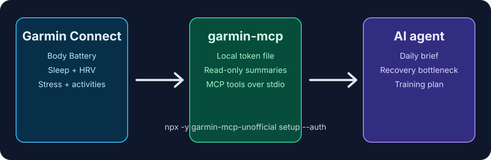

<!-- delx-wellness header v2 -->
<h1 align="center">Garmin MCP</h1>

<div align="center">
  
</div>

<h3 align="center">
  Give your AI agent your Garmin Body Battery, training readiness, sleep, HRV and activities.<br>
  Local-first MCP server &mdash; <strong>tokens never leave your machine</strong>.
</h3>

<p align="center">
  <a href="https://www.npmjs.com/package/garmin-mcp-unofficial"></a>
  <a href="https://github.com/davidmosiah/garmin-mcp/releases/latest"></a>
  <a href="https://www.npmjs.com/package/garmin-mcp-unofficial"></a>
  <a href="LICENSE"></a>
  <a href="https://wellness.delx.ai/connectors/garmin"></a>
</p>

<p align="center">
  <a href="https://github.com/davidmosiah/garmin-mcp/stargazers"></a>
  <a href="https://modelcontextprotocol.io"></a>
  <a href="https://github.com/davidmosiah/delx-wellness/blob/main/docs/release-index.md"></a>
  <a href="https://github.com/davidmosiah/delx-wellness-hermes"></a>
  <a href="https://github.com/davidmosiah/delx-wellness"></a>
</p>

> ⚡ **One-command install** with [Delx Wellness for Hermes](https://github.com/davidmosiah/delx-wellness-hermes):
> `npx -y delx-wellness-hermes setup` &mdash; preconfigures this connector and the full Delx Wellness stack in a dedicated Hermes profile.
>
> Or wire it standalone into Claude Desktop / Cursor / ChatGPT Desktop &mdash; see the install section below. Runnable examples live in the [Delx Wellness hub](https://github.com/davidmosiah/delx-wellness#run-it-in-your-agent).

> **Public proof:** Garmin MCP is tracked in the Delx [Open Source Growth Snapshot](https://github.com/davidmosiah/delx-wellness/blob/main/docs/open-source-growth-snapshot.md) alongside downloads, stars and next-action priorities. If it saves you Garmin Connect and MCP setup time, star this repo so other training-focused agent builders can find it faster.
>
> **First useful prompt:** `Use garmin_connection_status, then garmin_daily_summary, then give me a 5-line operating brief for today.`

---

<!-- /delx-wellness header v2 -->

# Garmin MCP

Give your AI agent your Garmin Body Battery, training readiness, sleep, HRV and activities — local-first, tokens never leave your machine.

> **Unofficial project.** Not affiliated with, endorsed by or supported by Garmin. This is **not** official Garmin Health API partnership access — it uses the unofficial Garmin Connect personal-token mode.

- **Install one connector** — `npx -y garmin-mcp-unofficial setup`
- **Run it in** Claude · Cursor · ChatGPT · Hermes · OpenClaw — [runnable examples](https://github.com/davidmosiah/delx-wellness#run-it-in-your-agent)
- **Local-first** — your Garmin tokens never leave the machine ([privacy](#privacy--what-runs-offline))
- **Which connector should I use?** — [pick one in the Delx Wellness front door](https://github.com/davidmosiah/delx-wellness#which-connector-should-i-use)

Part of [Delx Wellness](https://github.com/davidmosiah/delx-wellness), a registry of local-first wellness MCP connectors.

<p align="center">
  
</p>

## Quickstart in 60 seconds

No Garmin developer app is required. `setup` only writes local MCP configuration; it does not ask for your Garmin password.

```bash
npx -y garmin-mcp-unofficial setup            # writes local config
npx -y garmin-mcp-unofficial auth             # built-in login, prompts for credentials locally (no Python needed)
npx -y garmin-mcp-unofficial doctor           # verifies you're ready
```

## HTTP (v2 stateless)

Default is **stdio**. Optional Streamable HTTP — no session id, JSON responses, loopback only:

```bash
npx -y garmin-mcp-unofficial --http
# GET  http://127.0.0.1:3000/health
# POST http://127.0.0.1:3000/mcp   (sessionless)
```

Env: `GARMIN_MCP_HOST`, `GARMIN_MCP_PORT`, `GARMIN_MCP_TRANSPORT=http`.

Or one shot: `npx -y garmin-mcp-unofficial setup --auth`

`auth` runs a self-contained Node login and prompts locally for Garmin email, password and MFA when needed. The MCP **does not store your Garmin password** — only Garmin Connect tokens, saved at `~/.garmin-mcp/garmin_tokens.json` with user-only permissions. See the [auth quickstart walkthrough](examples/auth-quickstart.md) for real terminal output, or [docs/quickstart.md](docs/quickstart.md) for the full flow.

If Garmin returns HTTP 429, a Cloudflare challenge, or an auth message that says Garmin SSO omitted `responseStatus.type`, **stop retrying for a while**. Repeated headless login attempts can make the private endpoint throttle harder. Use [docs/auth.md](docs/auth.md#rate-limits-cloudflare-and-unknown-login-responses) for the safe recovery path.

Then add this to your MCP client config:

```json
{
  "mcpServers": {
    "garmin": {
      "command": "npx",
      "args": ["-y", "garmin-mcp-unofficial"]
    }
  }
}
```

## Try it with your agent

```text
Use garmin_connection_status to check setup, then run garmin_daily_summary.
Give me a 5-line operating brief for today.
```

```text
Call garmin_weekly_summary with response_format=json. Identify my biggest
recovery/sleep/stress bottleneck and give me a next-week plan.
```

```text
Use the garmin_intraday_investigation prompt for date=today, focus=stress.
Don't claim Garmin can prove anything it can't.
```

## Tools

Start with `garmin_connection_status`, then `garmin_daily_summary` (daily readiness, sleep, load) or `garmin_weekly_summary` (scorecard, bottlenecks, next-week plan). The server also exposes per-day signals (sleep, HRV, stress, Body Battery, training readiness, heart rate, SpO2, respiration, intensity minutes, hydration), activities, profile/devices and weight, plus prompts and resources.

See **[docs/tools.md](docs/tools.md)** for the full tool list, prompts, resources, data-availability matrix, configuration, Hermes setup and development notes.

## Privacy & what runs offline

- `GARMIN_PRIVACY_MODE` defaults to `summary` (more conservative than other Delx Wellness connectors) because the auth model is unofficial.
- In `structured` mode, normalized aliases are additive: complete upstream Garmin fields and nested DTOs remain available after secret/GPS redaction.
- Activity date ranges preserve the supplied calendar date and reject invalid values before contacting Garmin Connect.
- Garmin Connect tokens are stored at `~/.garmin-mcp/garmin_tokens.json` with user-only permissions and are never returned by tools. **Your Garmin password is never stored** — only short-lived tokens persist locally.
- The MCP client never sees Garmin credentials or tokens. Local cache is opt-in via `GARMIN_CACHE=sqlite`.
- This is **not medical advice**. The server exposes user-authorized data for personal AI workflows, not diagnosis or treatment.

See [docs/privacy.md](docs/privacy.md) for the full privacy model.

## See the full agent demo →

Want to see a connector like this drive a real end-to-end decision? The shared, reproducible proof lives in [`delx-living-body`](https://github.com/davidmosiah/delx-living-body):

```bash
npx -y delx-living-body demo
```

It answers the anchor question — **"Should I train hard today?"** — by combining recovery, sleep and training-load signals across the Delx Wellness connectors.

<!-- delx-wellness see-also -->

## See also

The full [Delx Wellness](https://wellness.delx.ai) connector library:

| Provider | Package | Repo |
|---|---|---|
| WHOOP | [`whoop-mcp-unofficial`](https://www.npmjs.com/package/whoop-mcp-unofficial) | [whoop-mcp](https://github.com/davidmosiah/whoop-mcp) |
| Oura | [`oura-mcp-unofficial`](https://www.npmjs.com/package/oura-mcp-unofficial) | [ouramcp](https://github.com/davidmosiah/ouramcp) |
| Garmin | [`garmin-mcp-unofficial`](https://www.npmjs.com/package/garmin-mcp-unofficial) | [garmin-mcp](https://github.com/davidmosiah/garmin-mcp) |
| Strava | [`strava-mcp-unofficial`](https://www.npmjs.com/package/strava-mcp-unofficial) | [strava-mcp](https://github.com/davidmosiah/strava-mcp) |
| Fitbit | [`fitbit-mcp-unofficial`](https://www.npmjs.com/package/fitbit-mcp-unofficial) | [fitbitmcp](https://github.com/davidmosiah/fitbitmcp) |
| Withings | [`withings-mcp-unofficial`](https://www.npmjs.com/package/withings-mcp-unofficial) | [withingsmcp](https://github.com/davidmosiah/withingsmcp) |
| Apple Health | [`apple-health-mcp-unofficial`](https://www.npmjs.com/package/apple-health-mcp-unofficial) | [apple-health-mcp](https://github.com/davidmosiah/apple-health-mcp) |
| Polar | [`polar-mcp-unofficial`](https://www.npmjs.com/package/polar-mcp-unofficial) | [polarmcp](https://github.com/davidmosiah/polarmcp) |
| Nourish (nutrition) | [`wellness-nourish`](https://www.npmjs.com/package/wellness-nourish) | [wellness-nourish](https://github.com/davidmosiah/wellness-nourish) |

**One-command setup for Hermes** — preconfigures every connector above plus wellness skills + onboarding: [`delx-wellness-hermes`](https://github.com/davidmosiah/delx-wellness-hermes).

<!-- /delx-wellness see-also -->

## Related local-first health MCP

Peer (not a Delx package): **[mi-fitness-data-bridge](https://github.com/shkyyy18/mi-fitness-data-bridge)** by [Kindred / @shkyyy18](https://github.com/shkyyy18) — Xiaomi Mi Fitness, local-first, shares the **agent-safe-series/v1** dense series envelope (duration-anchored coverage, hard `max_points`, full-res stats, no GPS in series tools). Design log: [#19](https://github.com/davidmosiah/garmin-mcp/issues/19) · parity notes: [docs/agent-safe-series-kindred.md](docs/agent-safe-series-kindred.md).

## 📧 Contact & Support

- 📨 **support@delx.ai** — general questions, integration help, partnerships
- 🐛 **Bug reports / feature requests** — [GitHub Issues](https://github.com/davidmosiah/garmin-mcp/issues)
- 🐦 **Updates** — [@delx369](https://x.com/delx369) on X
- 🌐 **Site** — [wellness.delx.ai](https://wellness.delx.ai)


## License

MIT — see [LICENSE](LICENSE).

## Disclaimer

This software is provided as-is. It is not a medical device, does not provide medical advice, and should not be used for diagnosis or treatment. The unofficial Garmin Connect mode can break if Garmin changes private auth or endpoints. Always consult qualified professionals for medical concerns.

**Daily brief demo:** [docs/daily-brief-demo.md](docs/daily-brief-demo.md)

